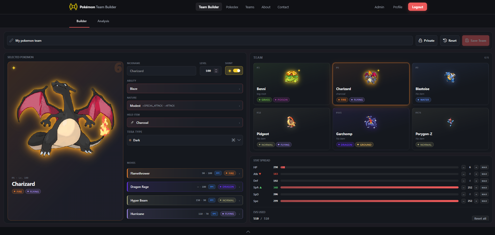
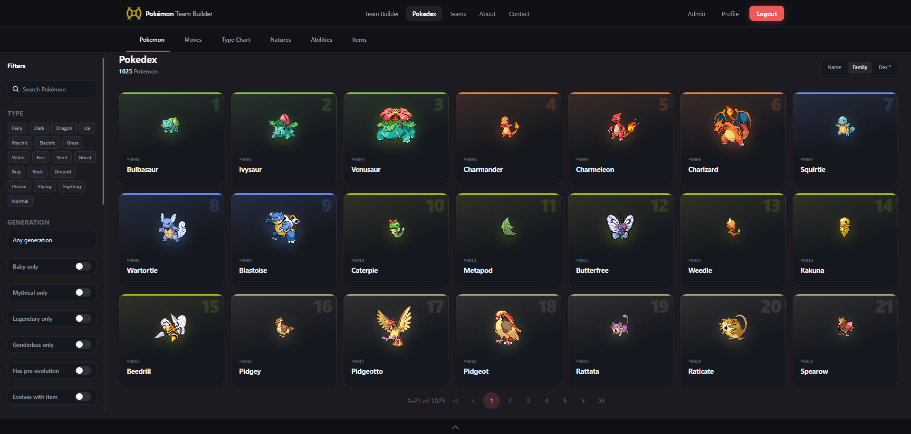
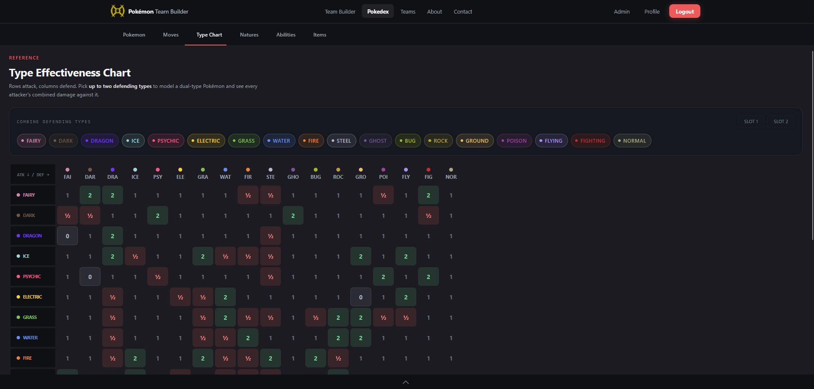
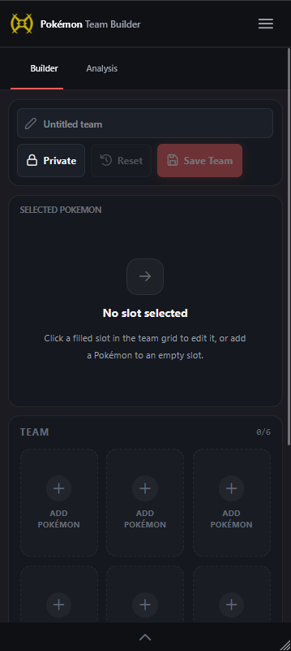
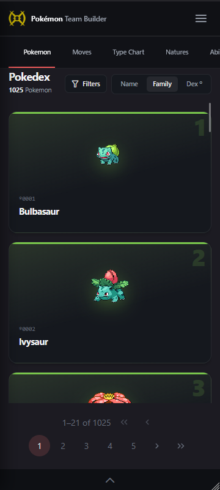
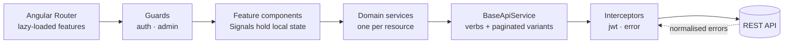
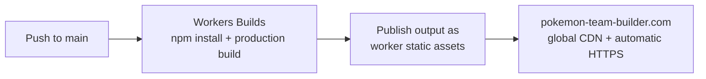

<div align="center">

# PokéTeam Builder - Frontend

**Angular 21 single-page application for [pokemon-team-builder.com](https://pokemon-team-builder.com)**

A competitive team builder with a full reference Pokédex, a team analysis engine,
community sharing and an administration panel.

<br>

[](https://pokemon-team-builder.com)
[](https://github.com/ManusolJ/pokemon-backend)

[](https://angular.dev/)
[](https://www.typescriptlang.org/)
[](https://tailwindcss.com/)
[](https://primeng.org/)
[](https://vitest.dev/)
[](https://workers.cloudflare.com/)

[](https://github.com/ManusolJ/pokemon-frontend/commits)

<a href="#screenshots">Screenshots</a> ·
<a href="#features">Features</a> ·
<a href="#architecture">Architecture</a> ·
<a href="#design-decisions">Design decisions</a> ·
<a href="#tech-stack">Tech stack</a> ·
<a href="#running-it-locally">Running it</a> ·
<a href="#deployment">Deployment</a> ·
<a href="#project-status-and-roadmap">Roadmap</a>

</div>

> [!TIP]
> API design, data model and deployment are documented in the
> [backend repository](https://github.com/ManusolJ/pokemon-backend).

---

## Screenshots

<table>
  <tr>
    <td width="50%" align="center">
      <br>
      <sub><b>Team builder</b></sub>
    </td>
    <td width="50%" align="center">
      <br>
      <sub><b>Analysis</b></sub>
    </td>
  </tr>
  <tr>
    <td width="50%" align="center">
      <br>
      <sub><b>Pokédex</b></sub>
    </td>
    <td width="50%" align="center">
      <br>
      <sub><b>Type-effectiveness matrix</b></sub>
    </td>
  </tr>
</table>

<table class="rd-mobile-table">
  <tr>
    <td>
      <br>
      <sub><b>Team builder - mobile</b></sub>
    </td>
    <td>
      <br>
      <sub><b>Pokédex - mobile</b></sub>
    </td>
  </tr>
</table>

---

## Features

| Area                        | What it does                                                                                                                                    |
| :-------------------------- | :---------------------------------------------------------------------------------------------------------------------------------------------- |
| **Team builder**            | Assemble up to six Pokémon with ability, nature, held item, Tera type, four moves and a full EV spread, with derived stats recalculated live.   |
| **Analysis view**           | Offensive and defensive type coverage across the whole team, role classification per member and aggregated team stats.                          |
| **Pokédex**                 | 1,025 species, 919 moves, 311 abilities, 305 items and 25 natures, all paginated and filterable, plus an interactive type-effectiveness matrix. |
| **Teams**                   | Save private or public teams, browse the community catalogue, like other players' teams.                                                        |
| **Accounts**                | Registration, login, password recovery and silent session renewal.                                                                              |
| **Admin panel**             | User management, dataset synchronisation and log inspection, behind a role guard.                                                               |
| **Responsive & accessible** | Fluid grid/flex layout across Tailwind's breakpoints, AA minimum contrast, visible focus on every interactive control and alt text throughout.  |

---

## Architecture



Every feature is lazy-loaded through the router, so the initial bundle carries only the
shell and the landing route.

State is handled with **Signals**. The application's state is mostly local to a feature -
the team being edited, the current filter set, the authenticated user - so there is no
global store. Signals gave fine-grained reactivity with far less indirection to follow when
debugging.

### Project structure

```
src/app/
├── core/                  provided once, used everywhere
│   ├── guards/            auth · admin route protection
│   ├── interceptors/      jwt (proactive refresh) · error (shape normalisation)
│   └── services/          BaseApiService + one service per resource
│
├── features/              each lazy-loaded, each owning its own routes
│   ├── about/
│   ├── admin/             user list & edit, seed trigger, log inspection
│   ├── auth/              login, registration, password reset
│   ├── contact/
│   ├── pokedex/           list + detail per resource, type chart
│   ├── profile/
│   ├── team-builder/      builder & analysis tabs, picker modals
│   └── teams/             public & private lists, detail, likes
│
├── shared/                cross-feature building blocks
│   ├── components/        navbar, footer, modal, list-shell, filter-sidebar,
│   │                      searchable-select, tab-nav, type-badge, pokemon-card
│   ├── constants/         api, auth, effectiveness, roles, stats, type colours
│   ├── interfaces/        api · auth · pokemon · team-builder · teams · ui
│   ├── pipes/             name-normalizer
│   ├── utils/             analysis, stats, roles, teams, type colours, dates
│   └── validators/        password
│
└── environments/          apiUrl + spritesBaseUrl, swapped at build time
```

<details>
<summary><b>Feature folder convention</b> - every feature has the same shape</summary>

<br>

Each feature keeps its components, its layout shell and its route definitions together,
so a feature can be read, moved or removed without hunting through shared folders. Every
component folder holds a matching `.ts` / `.html` / `.css` trio.

```
features/team-builder/
├── components/
│   ├── builder-tab/           analysis-tab/
│   ├── team-grid/             selected-pokemon/
│   ├── stat-spread/           team-stats/
│   ├── role-spread/           offensive-coverage/
│   └── defensive-coverage/
├── layout/
│   └── team-builder-layout
├── modals/
│   ├── pokemon-picker/        move-picker/
│   ├── ability-picker/        item-picker/
│   └── nature-picker/
└── routes/
    └── team-builder.routes.ts
```

</details>

---

## Design decisions

### One generic HTTP layer

`BaseApiService` exposes `get`, `post`, `put`, `patch`, `delete` and paginated variants
(`getPaged`, `postPaged`), and every domain service extends it.

Eight domains each hand-rolling pagination parameters, response unwrapping and error shapes
is easy to get wrong. Centralising it means a change to the pagination contract is a
one-file change, and each domain service is left holding only the endpoints it actually
owns.

### Proactive token refresh in the interceptor

`jwtInterceptor` attaches the access token and renews it **before** it expires, rather than
reacting to a 401 and retrying.

The reactive approach works, but it means every session eventually produces a failed
request - and with a queue of parallel requests, a stampede of them.

> Refreshing ahead of expiry keeps the failure path for genuine authentication failures
> only.

`errorInterceptor` normalises everything the API can return into a single shape, so
components never branch on transport-level details.

### The in-progress team survives a login

`TeamBuilderStateService` persists the team currently being edited to `localStorage`.

This exists because of a specific flow: the builder is fully usable while logged out, and
the save button prompts for authentication.

> Without persistence, signing in to save would navigate away and destroy the exact thing
> the user was trying to save.

Restoring from local storage after the auth round trip makes the path work.

### Styling through tokens

The palette lives in `src/styles.css` as `--color-brand-*` custom properties consumed by
Tailwind, and PrimeNG is themed via a **custom preset** built on those same tokens.

The alternative - fighting PrimeNG's default theme with `::ng-deep` and specificity classes

- produces a stylesheet that breaks on every library upgrade. Driving both systems from one
  set of variables keeps the two visually consistent and makes a palette change a single-file
  edit.

### SPA routing on the edge

The app is served as static assets by a Cloudflare Worker with `assets.not_found_handling`
set to `single-page-application`, so unknown paths return `index.html` and Angular's router
resolves them client-side. Deep links work without a server. `workers_dev` and
`preview_urls` are disabled, so no unintended public URLs exist alongside the production
domain.

---

## Tech stack

| Layer           | Technology                                                      |
| :-------------- | :-------------------------------------------------------------- |
| **Framework**   | Angular 21 - standalone components, Signals, lazy-loaded routes |
| **Language**    | TypeScript                                                      |
| **Styling**     | Tailwind CSS 4 + PostCSS, custom design tokens                  |
| **Components**  | PrimeNG 21, PrimeIcons 7                                        |
| **Auth helper** | jwt-decode 4                                                    |
| **Testing**     | Vitest 4                                                        |
| **Deployment**  | Cloudflare Workers via Wrangler 4 + Workers Builds              |

---

## Running it locally

**Requirements:** Node.js

```bash
git clone https://github.com/ManusolJ/pokemon-frontend.git
cd pokemon-frontend

npm install
npm start
```

The app runs at `http://localhost:4200`.

> [!IMPORTANT]
> The frontend needs an API to talk to. Either point it at the live API, or run the
> [backend](https://github.com/ManusolJ/pokemon-backend) locally with Docker Compose and
> target that instead.

### Configuration

Two values are configured per environment:

| Field            | Purpose                            |
| :--------------- | :--------------------------------- |
| `apiUrl`         | Base URL of the REST API           |
| `spritesBaseUrl` | Base URL for Pokémon sprite assets |

These live in the environment source files and are swapped at build time through Angular's
file replacements. They are build-time constants, not runtime environment variables,
because a static bundle on a CDN has no runtime environment to read from.

### Scripts

```bash
npm start          # dev server with HMR
npm run build      # production build → dist/pokemon-team-builder/browser/
```

---

## Deployment

The Cloudflare Workers project is connected to this repository through **Workers Builds**,
so every push to `main` triggers the pipeline automatically.



Cloudflare installs dependencies, runs the production build and publishes the output as the
worker's static assets, following `wrangler.jsonc`. The custom domain
`pokemon-team-builder.com` is bound to the worker, which provides global CDN distribution
and automatic HTTPS certificates with no server to maintain.

---

## Project status and roadmap

Live and in use, but not finished:

- [ ] **Meaningful test coverage.** Vitest is configured; the highest-value targets are
      `BaseApiService`, the interceptors and the team-builder state service.
- [ ] **End-to-end tests** with Playwright.
- [ ] **Team comparator** - pit two public teams against each other and analyse the
      matchup.
- [ ] **Showdown import/export** in the standard team format.
- [ ] **Internationalisation** - the UI is English-only.
- [ ] **Comments on public teams.**

---

## Disclaimer

> [!NOTE]
> Pokémon and all related names are trademarks of Nintendo, Game Freak and The Pokémon
> Company. This is a non-commercial fan project built for learning purposes and is not
> affiliated with or endorsed by them. Game data comes from the community-maintained
> [PokéAPI](https://pokeapi.co/).

---

<div align="center">

### Author

**Manuel Soler Juan** - Junior full stack developer

[](https://github.com/ManusolJ)
[](https://linkedin.com/in/manusolerj)

</div>

<style>
    .rd-mobile-table {
        width: 100%
    }

    .rd-mobile-table tr {
        display: flex;
        justify-content: space-around;
    }

    .rd-mobile-table tr td sub b {
        width: 100%;
        display: flex;
        justify-content: center;
        margin-top: 1rem
    }
